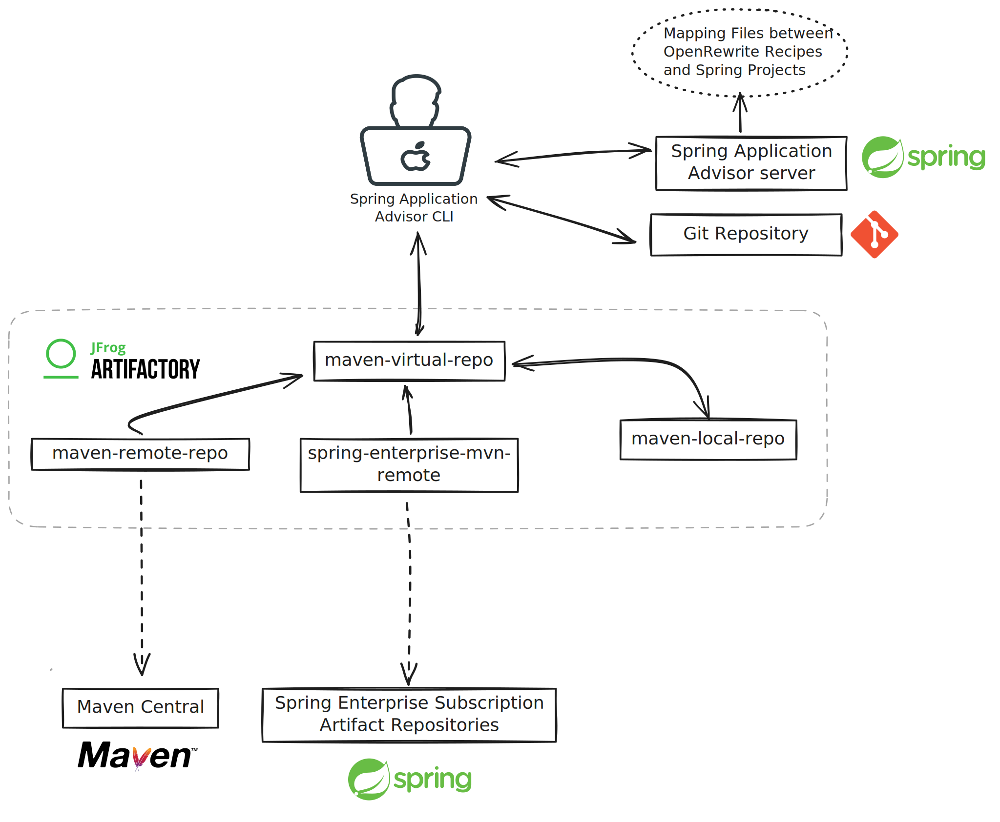

Spring Application Advisor Local Demo
=================


Spring Advisor Local Demo including a Spring Application Advisor Server, an Artifactory Server and a Git server running on Docker

- [Basic Usage](#basic-usage)
- [Remote Maven Repository Configuration](#remote-maven-repository-configuration)
- [Commands Cheat Sheet](#commands-cheat-sheet)


Basic Usage
-----------
Simply run:

```
./install.sh
```


### Clean up

To uninstall and clean up:

```
./cleanup.sh
```


Remote Maven Repository Configuration
---------------------
### Connect to the local Artifactory

[http://localhost:8082/ui/login/](http://localhost:8082/ui/login/)


Using `admin` as user and `password` as password.

- In the `Administration` tab, select `Repositories` in the left menu
- Click `Create a Repository`, select `Remote`, select `Maven`
    - Enter the following information:
        - Repository Key: `spring-enterprise-mvn-remote`
        - URL: https://packages.broadcom.com/artifactory/spring-enterprise
        - User Name: `email address` for this account
        - Password / Access Token: the value with the save `Access Token` file for attribute `access_token`
    - Click `Test` if successful click `Create Remote Repository`
- Click `Create a Repository`, select `Remote`, select `Maven`
    - Enter the following information:
        - Repository Key: `maven-remote-repo`
    - Click `Create Remote Repository`
- Click `Create a Repository`, select `Local`, select `Maven`
    - Enter the following information:
        - Repository Key: `maven-local-repo`
    - Click `Create Local Repository`
- Click `Create a Repository`, select `Virtual`, select `Maven`
    - Enter the following information:
        - Repository Key: `maven-virtual-repo`
        - In the `Repositories` section, add the `maven-local-repo`, `maven-remote-repo`, `spring-enterprise-mvn-remote` repositories to the `Selected Repositories` panel
    - Click `Create Virtual Repository`
 
<br>



Commands Cheat Sheet
---------------------

```
advisor build-config get
advisor build-config publish
advisor upgrade-plan get
advisor upgrade-plan apply
git diff
git add -A && git commit -m \"Java 8 to 11\"
git push
```

Links
-------

https://techdocs.broadcom.com/us/en/vmware-tanzu/spring/tanzu-spring/commercial/spring-tanzu/app-advisor-app-advisor-examples.html

https://techdocs.broadcom.com/us/en/vmware-tanzu/spring/tanzu-spring/commercial/spring-tanzu/guide-artifact-repository-administrators.html#adding-remote-repository-in-artifactory

https://techdocs.broadcom.com/us/en/vmware-tanzu/spring/tanzu-spring/commercial/spring-tanzu/app-advisor-run-app-advisor-cli.html
