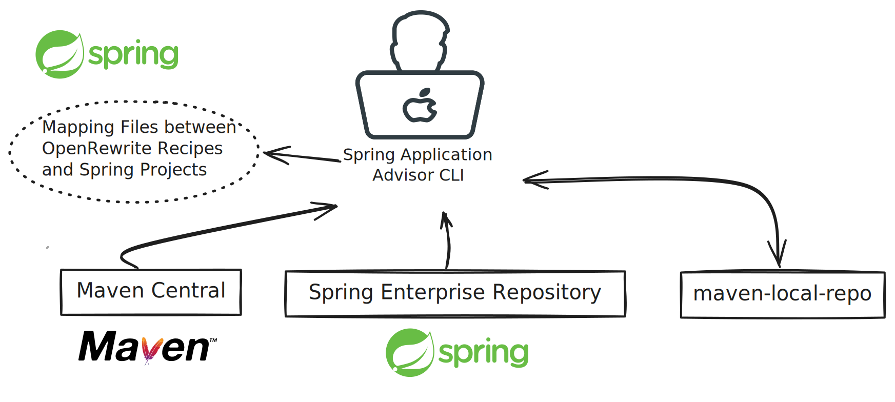
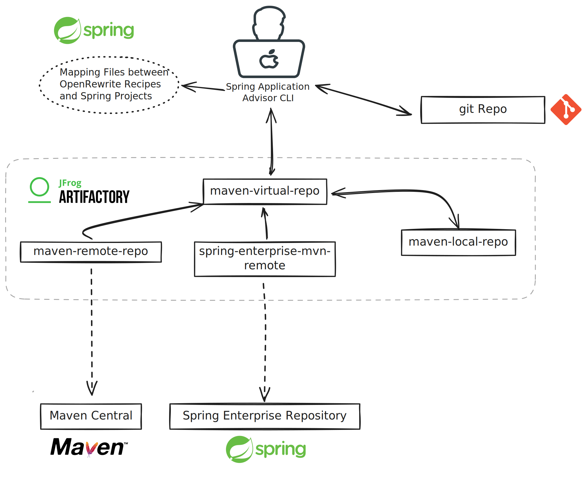

# Spring Application Advisor Demo

Local hands-on demo for **[Application Advisor 1.6.3](https://techdocs.broadcom.com/us/en/vmware-tanzu/spring/application-advisor/1-6/app-advisor/index.html)** — upgrade **Spring Petclinic** from Boot 2.7 to 4.0 and explore **custom upgrade mappings** for internal shared libraries.

🇫🇷 [Version française](README.fr.md)

## What’s included

| Demo | Description | Guide |
|---|---|---|
| **Demo 1** | Spring Boot 2.7 → 4.0 incremental upgrade | [docs/DEMO-1-upgrade-boot.md](docs/DEMO-1-upgrade-boot.md) |
| **Demo 2** | Custom mapping for `acme-spring-commons`; finish Boot upgrade with Demo 1 loop | [docs/DEMO-2-custom-upgrades.md](docs/DEMO-2-custom-upgrades.md) |
| **MCP** | IDE integration via `advisor mcp` (no server required) | [docs/MCP_CONFIGURATION_GUIDE.md](docs/MCP_CONFIGURATION_GUIDE.md) |

Official how-to index: [Application Advisor how-to guides](https://techdocs.broadcom.com/us/en/vmware-tanzu/spring/application-advisor/1-6/app-advisor/app-advisor-examples.html)

## Prerequisites

- **macOS or Linux** (auto-detected)
- **Broadcom Support Portal** account with ability to create/login and obtain a **Registry Token**
- Entitlement: **Tanzu Spring** or **Tanzu Platform**
- **JDK 17+** minimum for Advisor CLI; **JDK 8, 11, 17** recommended for the upgrade path
- **Git**, **curl**, **Maven** (or use `./mvnw` in petclinic)
- **Enterprise lab mode only:** Docker, Podman, or another OCI-compatible container engine (auto-detected)

### Maven repository access

- **Minimal mode:** Maven Central + `https://packages.broadcom.com/artifactory/spring-enterprise/` (direct), or your organization's **internal mirror** of Spring Enterprise — configure the URL/credentials your platform team provides in `~/.m2/settings.xml`.
- **Enterprise lab mode:** local Artifactory OSS proxies Spring Enterprise (see install menu option 2).

## Quick start

```bash
git clone <this-repo>
cd spring-application-advisor-demo
./install.sh
```

Interactive menu:

1. **Minimal** (default) — Maven direct to Spring Enterprise; no containers
2. **Enterprise lab** — Artifactory OSS mirror (with Postgres)
3. **Optional:** local Git server (reconfigures `spring-petclinic` origin for `git push` demos)

Credentials are stored optionally in `.envrc` (see `.envrc.example`). **Never commit tokens.**

## Architecture

Two install modes — same **Application Advisor CLI**, different Maven topology.

### Minimal setup (recommended)



The **Spring Application Advisor CLI** reads **mapping files** (OpenRewrite recipes ↔ Spring projects) from `demo/mappings/` — for example `acme-spring-commons.json` in Demo 2.

Maven resolves artifacts directly from **Maven Central** and the **Spring Enterprise Repository**; the CLI caches them in **`~/.m2`**. For Demo 2, offline **`acme-spring-commons`** JARs in **`demo/local-repo/`** are bootstrapped into `~/.m2` by `./demo/reset-demo.sh`.

### Enterprise lab (optional)



Same CLI and **mapping files** flow. Maven is pointed at a local **Artifactory OSS** mirror (with Postgres; pre-configured repos from `repoesbackup.zip`):

| Artifactory repo | Role |
|---|---|
| `maven-virtual-repo` | Single Maven URL in `settings.xml` |
| `maven-remote-repo` | Proxies **Maven Central** |
| `spring-enterprise-mvn-remote` | Proxies **Spring Enterprise Repository** |
| `maven-local-repo` | Cached artifacts on the mirror |

An optional local **Git repo** (install menu option 3) lets you demo `git push` after `advisor upgrade-plan apply`.

After enterprise install, **Artifactory UI:** http://localhost:8082/ui/login/ (`admin` / `password` — local demo only).

### Demo 1 — Boot upgrade

```bash
cd spring-petclinic
advisor build-config get
advisor upgrade-plan get
advisor upgrade-plan apply
git diff
```

See [docs/DEMO-1-upgrade-boot.md](docs/DEMO-1-upgrade-boot.md) for the full Java 8 → 11 → 17 → Boot 4 flow.

### Demo 2 — Custom shared library

```bash
./demo/reset-demo.sh
export SPRING_ADVISOR_MAPPING_CUSTOM_0_FILEPATH="$(pwd)/demo/mappings/acme-spring-commons.json"
cd spring-petclinic
advisor upgrade-plan get
```

See [docs/DEMO-2-custom-upgrades.md](docs/DEMO-2-custom-upgrades.md). Then continue with the [Demo 1 incremental upgrade loop](docs/DEMO-1-upgrade-boot.md#incremental-upgrade-loop) to reach Boot 4.0.

## Repository layout

```
├── install.sh                 # interactive setup entry point
├── scripts/                   # modular install/uninstall scripts
├── config/                    # Maven + MCP templates
├── demo/                      # acme-spring-commons, local-repo, mappings, reset-demo.sh
├── docs/                      # step-by-step guides
├── assets/                    # architecture diagrams (SVG)
├── spring-petclinic/          # cloned at install (gitignored)
└── repoesbackup.zip           # Artifactory pre-config (enterprise lab only)
```

## Uninstall

```bash
./uninstall.sh    # stop containers, remove petclinic clone
./cleanup.sh      # also remove images, .envrc, downloaded CLI tarball
```

Neither script deletes your entire `~/.m2` cache.

## Additional resources

- [Application Advisor intro (Spring Academy)](https://spring.academy/guides/app-advisor-intro)
- [Upgrade Spring Boot 2.7 → 4.0](https://techdocs.broadcom.com/us/en/vmware-tanzu/spring/application-advisor/1-6/app-advisor/how-to-guides-upgrade-boot.html)
- [Custom upgrade mappings](https://techdocs.broadcom.com/us/en/vmware-tanzu/spring/application-advisor/1-6/app-advisor/custom-upgrades.html)
- [Spring Enterprise Repository (developers)](https://techdocs.broadcom.com/us/en/vmware-tanzu/spring/tanzu-spring/commercial/spring-tanzu/guide-artifact-repository-developers.html)
- [Spring Enterprise Repository (administrators)](https://techdocs.broadcom.com/us/en/vmware-tanzu/spring/tanzu-spring/commercial/spring-tanzu/guide-artifact-repository-administrators.html)

---

### Windows users

This demo is tested on **macOS and Linux**. On Windows, use **WSL2** (Ubuntu) and run `./install.sh` there, or install manually:

- Download `application-advisor-cli-windows-1.6.3` from the Spring Enterprise repository (`packages.broadcom.com`)
- Configure `%USERPROFILE%\.m2\settings.xml` using `config/settings-maven-direct.xml.template`
- Use `mvnw.cmd` instead of `./mvnw`
